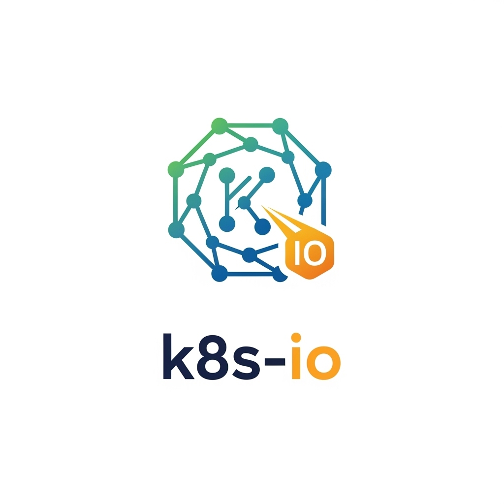

# K8s-IO - Kubernetes Benchmark Tool

<p align="center">
  
</p>

K8s-IO is a lightweight Go-based CLI tool for running benchmark workloads on Kubernetes clusters. Unlike operator-based solutions, it provides a simple command-line interface for executing benchmarks without requiring cluster-wide operator deployments. It supports multiple benchmark types and reuses existing Jinja templates from the benchmark-operator project.

## Supported Workloads

- **FIO**: Distributed I/O benchmark using FIO (Flexible I/O Tester)
- **HammerDB**: Database performance benchmark supporting PostgreSQL, MariaDB, and MSSQL

## Installation

### Prerequisites

- Go 1.21 or later
- Kubernetes cluster access (kubeconfig configured)
- kubectl (optional, for manual verification)

### Building from Source

```bash
git clone <repository>
cd k8s-io
go mod tidy
go build -o k8s-io .
```

## Usage

### Basic Commands

```bash
# Run FIO benchmark
./k8s-io -config config-fio.yaml

# Run HammerDB benchmark
./k8s-io -config config-hammerdb.yaml

# Generate manifests without applying (dry-run)
./k8s-io -config config-fio.yaml -dry-run

# Cleanup resources after benchmark
./k8s-io -config config-fio.yaml -cleanup
```

### Configuration

The tool uses YAML configuration files to specify benchmark parameters. See the example configurations:

- `config-fio.yaml` - FIO distributed benchmark configuration
- `config-hammerdb.yaml` - HammerDB database benchmark configuration

#### FIO Configuration Example

```yaml
namespace: "benchmark-fio"
workload:
  name: "fio"
  args:
    kind: "pod"              # "pod" or "vm"
    servers: 2               # Number of FIO server pods
    samples: 3               # Test iterations
    jobs: ["read", "write"]  # FIO job types
    bs: ["4KiB", "8KiB"]         # Block sizes
    numjobs: [1, 2]          # FIO processes per pod
    filesize: "1G"           # File size for testing
    storageclass: "fast-ssd" # Kubernetes storage class
    fio_path: "/data"        # Path where FIO tests run (optional)
                             # Defaults: /tmp for pods, /test for VMs  
    prefill: true            # Enable prefill
```

#### HammerDB Configuration Example

```yaml
namespace: "benchmark-hammerdb"
workload:
  name: "hammerdb"
  args:
    kind: "pod"              # "pod" or "vm"
    db_type: "pg"            # "pg", "mariadb", "mssql"
    db_init: true            # Initialize database
    db_benchmark: true       # Run benchmark
    db_server: "postgresql.default.svc.cluster.local"
    warehouses: 10           # TPC-C warehouses
    virtual_users: 5         # Concurrent users
    duration: 10             # Test duration (minutes)
```

## Storage Classes

For FIO benchmarks, you can specify a storage class to test different storage types:

```yaml
workload:
  args:
    storageclass: "fast-ssd"    # Use specific storage class
    storagesize: "10Gi"         # PVC size
```

Available options depend on your cluster. To check available storage classes:

```bash
kubectl get storageclass
```

If no storage class is specified, FIO will use local temporary storage (`/tmp`).

## Architecture

The tool follows a modular architecture:

```
k8s-io/
├── main.go                 # Main application entry point
├── pkg/
│   ├── config/            # Configuration management
│   ├── kubernetes/        # Kubernetes client wrapper
│   └── workloads/         # Workload implementations
│       ├── interface.go   # Workload interface and factory
│       ├── fio/          # FIO workload implementation
│       │   ├── config.go
│       │   ├── workload.go
│       │   ├── templates.go
│       │   └── templates/ # FIO Jinja templates
│       └── hammerdb/     # HammerDB workload implementation
│           ├── config.go
│           ├── workload.go
│           ├── templates.go
│           └── templates/ # HammerDB Jinja templates
```

### Adding New Workloads

To add a new workload:

1. Create a new package under `pkg/workloads/`
2. Implement the `Workload` interface
3. Add configuration structures
4. Create template engine for the workload
5. Update the factory in `pkg/workloads/interface.go`

## Templates

The tool reuses existing Jinja templates from the benchmark-operator project:

- **FIO templates**: Located in `pkg/workloads/fio/templates/`
- **HammerDB templates**: Located in `pkg/workloads/hammerdb/templates/`

Templates are automatically converted from Jinja2 to Pongo2 syntax during rendering.

## Development

### Running Tests

```bash
go test ./...
```

### Building for Different Platforms

```bash
# Linux
GOOS=linux GOARCH=amd64 go build -o k8s-io-linux .

# macOS
GOOS=darwin GOARCH=amd64 go build -o k8s-io-macos .

# Windows
GOOS=windows GOARCH=amd64 go build -o k8s-io-windows.exe .
```

## License

This project is licensed under the Apache License 2.0 - see the LICENSE file for details.

## Related Projects

- [benchmark-operator](https://github.com/cloud-bulldozer/benchmark-operator) - Ansible-based benchmark operator (this tool reuses its templates)
- [FIO](https://github.com/axboe/fio) - Flexible I/O Tester
- [HammerDB](https://www.hammerdb.com/) - Database load testing tool

## Why K8s-IO vs benchmark-operator?

K8s-IO provides a simpler alternative to the benchmark-operator for users who:
- Want a lightweight CLI tool instead of a full operator
- Don't need cluster-wide operator deployments
- Prefer direct control over benchmark execution
- Want to run benchmarks without operator overhead
